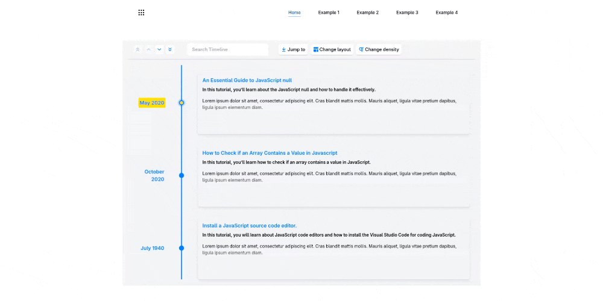

# How to Build Timelines in React Using React Chrono?

Step-by-Step: Building Timelines in React Using React Chrono.

---
[How to Build Timelines in React Using React Chrono?](https://medium.com/frontendweb/how-to-build-timelines-in-react-using-react-chrono-13bc1ced470a)
---

## Demo



## Getting Started

The first step is to clone the **react-chrono** project with a git command.

```bash
git clone https://github.com/officialrajdeepsingh/react-chrono.git

# change folder
cd react-chrono
```
The next step is to install the Node Package using the Node Package Manager.

```bash
pnpm install
# or
yarn install
# or
npm install
```

Lastly, run the development server:

```bash
npm run dev
# or
yarn dev
# or
pnpm dev
# or
bun dev
```

Open [http://localhost:3000](http://localhost:3000) with your browser to see the result.
